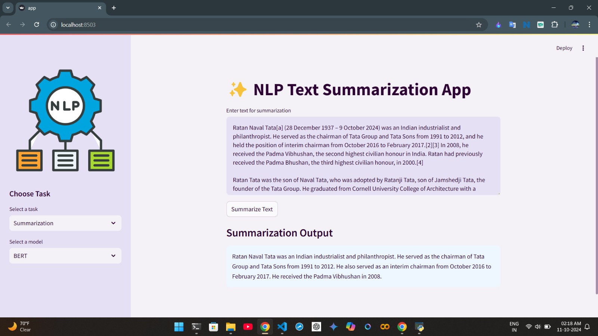
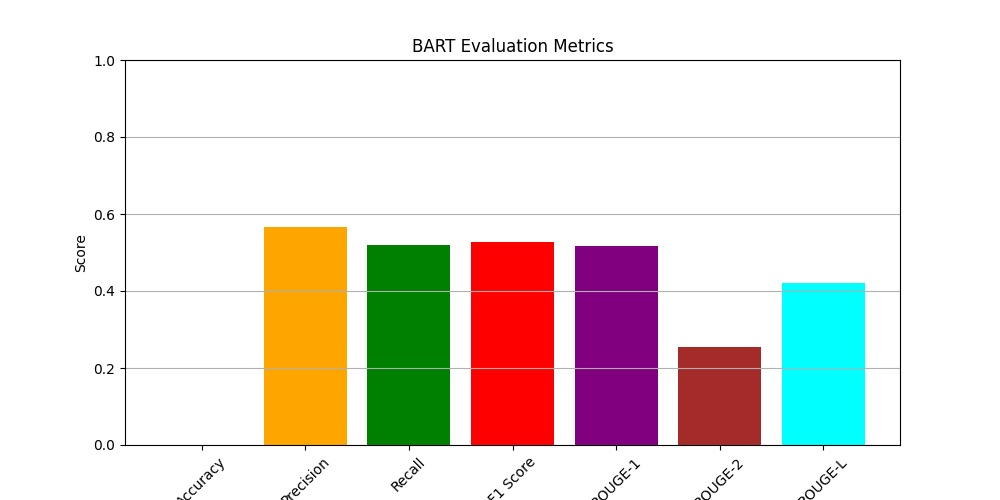
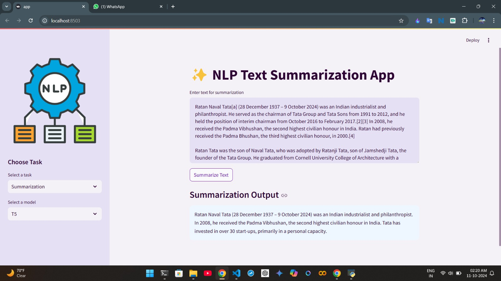
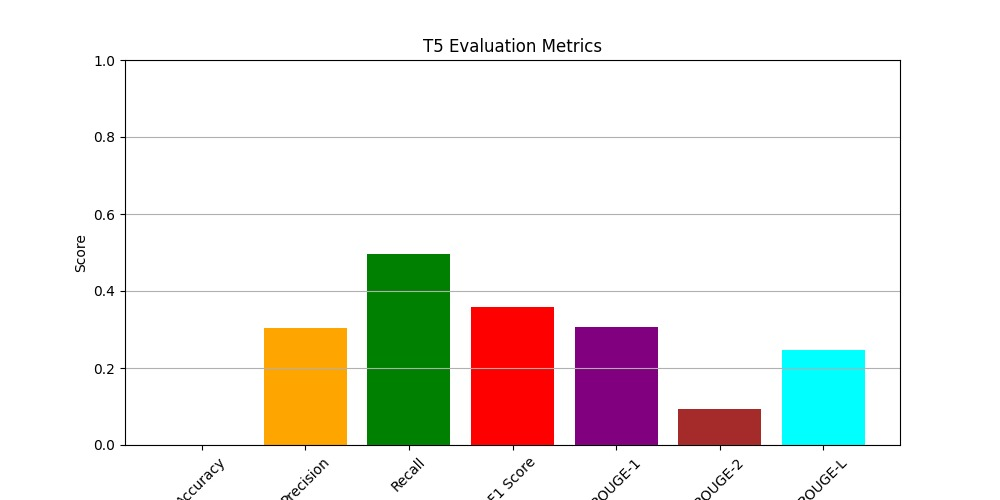
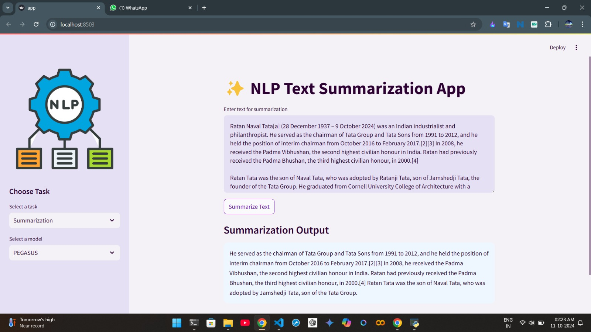
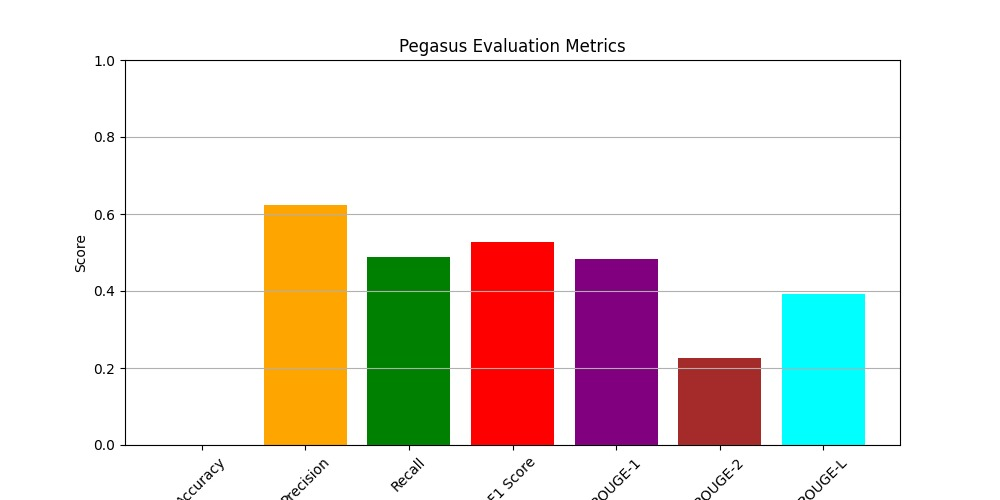

# NLP Summarization Application

This application utilizes pre-trained NLP models for text summarization tasks, supporting models like BART, T5, and PEGASUS. It uses PyTorch and Hugging Face’s Transformers library to generate concise summaries from user-provided text inputs.

## Features

- **Summarization Models**: Supports BART, T5, and PEGASUS, allowing for flexible summarization options.
- **Custom Model Paths**: Load pre-trained models and tokenizers from specified local paths for customized use.

## Requirements

- **Python** 3.8+
- **Libraries**: `streamlit`, `torch`, `transformers`

Install the required libraries using:
```bash
pip install streamlit torch transformers


## Bert



- **ROUGE-1**: 0.5163
- **ROUGE-2**: 0.2539
- **ROUGE-L**: 0.4215
- **Accuracy**: 0.0000
- **Precision**: 0.5650
- **Recall**: 0.5196
- **F1 Score**: 0.5283

## T5



- **ROUGE-1**: 0.3076
- **ROUGE-2**: 0.0936
- **ROUGE-L**: 0.2471
- **Accuracy**: 0.0000
- **Precision**: 0.3030
- **Recall**: 0.4964
- **F1 Score**: 0.3579

## T5



- **ROUGE-1**: 0.4820
- **ROUGE-2**: 0.2262
- **ROUGE-L**: 0.3912
- **Accuracy**: 0.0000
- **Precision**: 0.6231
- **Recall**: 0.4894
- **F1 Score**: 0.5281